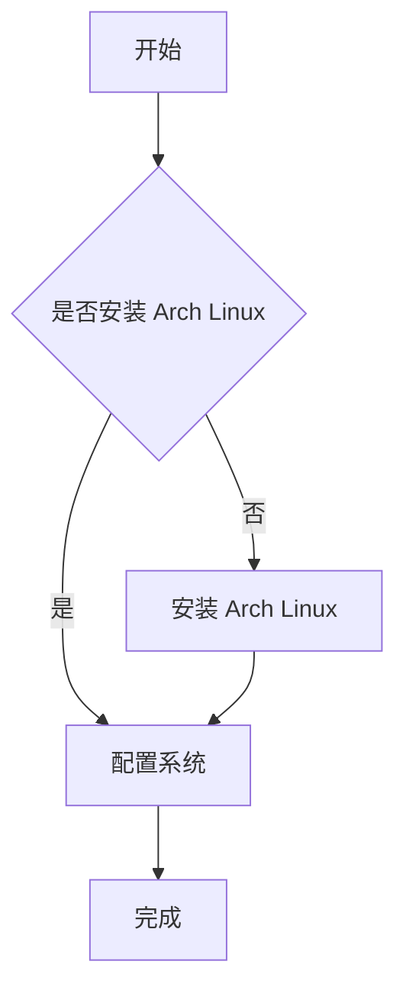
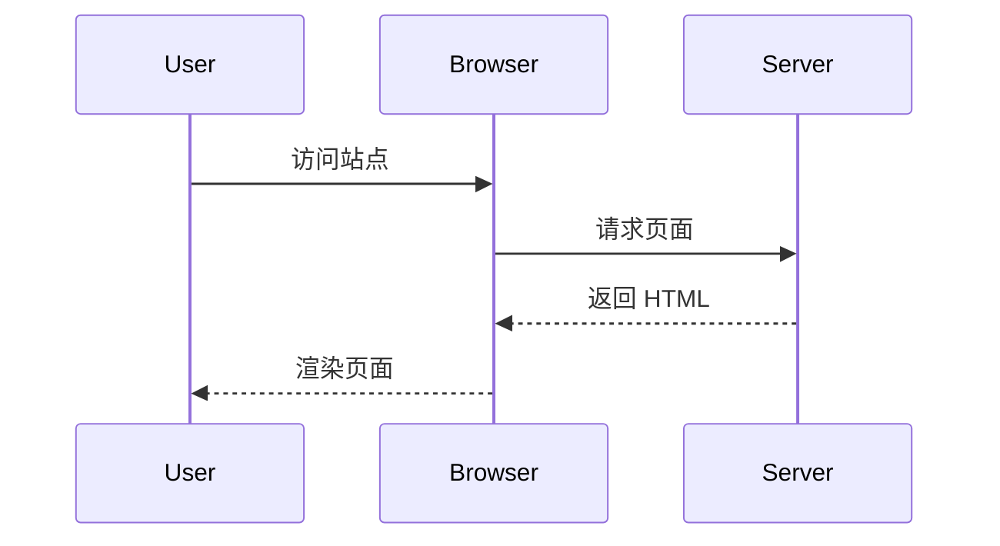

# Mermaid 示例

以下是使用 Mermaid 绘制的流程图：

```mermaid
graph TD
    A[开始] --> B{是否安装 Arch Linux}
    B -->|是| C[配置系统]
    B -->|否| D[安装 Arch Linux]
    C --> E[完成]
    D --> C
```

以下是序列图：

```mermaid
sequenceDiagram
    participant User
    participant Browser
    participant Server
    User->>Browser: 访问站点
    Browser->>Server: 请求页面
    Server-->>Browser: 返回 HTML
    Browser-->>User: 渲染页面
```
